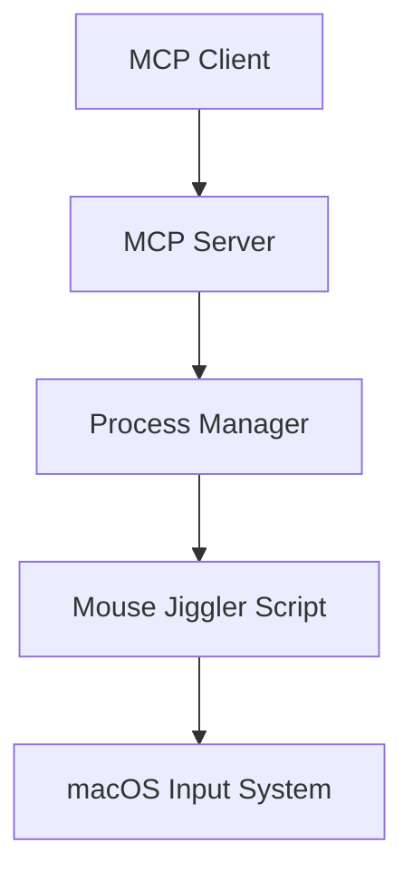
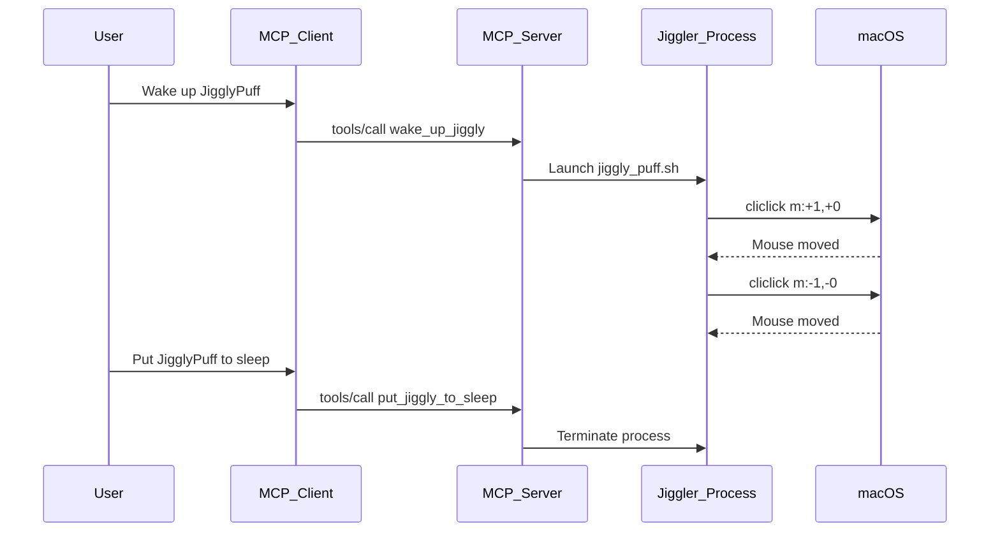

# jigglypuff: AI-Controlled Mouse Activity Manager

## Purpose

jigglypuff is specifically designed for AI agents to maintain system activity during processing tasks while allowing the system to sleep when waiting for user input. The AI agent can toggle the activity manager on when actively processing and off when awaiting user response. The implementation prevents both screen savers and system sleep during active processing.

## Project Rules

- Follow GitFlow branching strategy with feature branches
- Commit frequently with small, focused changes
- Update documentation alongside code changes
- Test changes in isolation before merging
- Use GitHub with username 'trose' for repository hosting
- Follow KISS principle - Keep It Simple, Stupid
- Use modern Python 3.x for implementation
- Project name: jigglypuff - AI-Controlled Mouse Activity Manager
- Always update task list after completing each task
- Write unit tests for all core functionality
- Never skip tests - all tests must be executed
- Never use mock/fake data to pass a test - all tests must use real system interactions
- Use type hints in Python code for better code clarity and IDE support
- Follow PEP 8 style guide for Python code
- Include docstrings for all functions and classes
- Use meaningful variable and function names
- Handle exceptions appropriately with try/except blocks
- Log important events and errors for debugging purposes
- Validate all input parameters and user inputs
- Use constants for magic numbers and configuration values
- Keep functions small and focused on a single responsibility
- Avoid global variables when possible
- Use context managers (with statements) for resource management
- Run code through linter (pylint, flake8) before committing
- Format code with black or autopep8 for consistent styling

## Implementation Tasks

### Phase 1: Environment Setup and Repository Initialization
- [ ] Initialize Git repository with `git init`
- [ ] Create `develop` branch for GitFlow workflow
- [ ] Set up `.gitignore` file with standard Python and macOS exclusions
- [ ] Create GitHub repository `jigglypuff` under `trose` account
- [ ] Install Homebrew (if not already installed)
- [ ] Install cliclick using `brew install cliclick`
- [ ] Install Python MCP SDK using `pip install mcp`
- [ ] Verify cliclick is working with `cliclick p` (should print current mouse position)
- [ ] Commit: "chore: Initial environment setup and dependencies"

### Phase 2: Core Implementation
- [ ] Create feature branch `feature/jigglypuff-script`
- [ ] Create `jiggly_puff.sh` script with basic mouse movement logic
- [ ] Test script manually to verify it moves the mouse with actual cursor position checks
- [ ] Commit: "feat: Create jigglypuff script with basic functionality"
- [ ] Create feature branch `feature/mcp-server`
- [ ] Create `mcp_server.py` with FastMCP server implementation
- [ ] Implement `wake_up_jiggly`, `put_jiggly_to_sleep`, and `check_jiggly_status` tools
- [ ] Add parameter validation and error handling
- [ ] Make scripts executable with `chmod +x`
- [ ] Test MCP server locally with real MCP client connections
- [ ] Commit: "feat: Implement MCP server with wake up/sleep/status tools"
- [ ] Merge feature branches to `develop` with pull requests

### Phase 3: Configuration and Documentation
- [ ] Create feature branch `feature/configuration`
- [ ] Create `README.md` with setup and usage instructions
- [ ] Document troubleshooting steps
- [ ] Add example configurations for different MCP clients (Qoder, Claude Desktop, and generic)
- [ ] Configure accessibility permissions in macOS System Preferences
- [ ] Set up MCP client configuration
- [ ] Test tool discovery in MCP client with actual tool invocation
- [ ] Commit: "docs: Add configuration and usage documentation"
- [ ] Merge feature branch to `develop` with pull request

### Phase 4: Testing
- [ ] Create feature branch `feature/testing`
- [ ] Test `wake_up_jiggly` with various parameters using real parameter values
- [ ] Verify mouse movement occurs at expected intervals with actual timing measurements
- [ ] Test `check_jiggly_status` shows correct status with real process state verification
- [ ] Test `put_jiggly_to_sleep` terminates the process with actual process termination
- [ ] Verify only one instance can run at a time with real concurrent execution attempts
- [ ] Test error cases (invalid parameters, permissions issues) with actual error conditions
- [ ] Test AI agent workflow scenarios with real AI agent interactions
- [ ] Test both screen saver and system sleep prevention with actual system behavior
- [ ] Commit: "test: Comprehensive testing of all functionality"
- [ ] Merge feature branch to `develop` with pull request

### Phase 5: Release Preparation
- [ ] Create `release/v1.0.0` branch from `develop`
- [ ] Update version numbers in documentation
- [ ] Final testing on clean environment with real system setup
- [ ] Merge `release/v1.0.0` to `main` and `develop`
- [ ] Create Git tag `v1.0.0`
- [ ] Push tags and branches to GitHub repository `jigglypuff` under `trose` account

## Overview

This document outlines the design of jigglypuff, a lightweight mouse activity manager for macOS that can be controlled via Model Context Protocol (MCP) tools. jigglypuff is designed to keep the screen alive while an AI agent is processing tasks, preventing screen savers from activating or systems from going to sleep. The AI agent can toggle the activity manager on when actively processing and off when waiting for user input. The implementation uses native macOS tools and provides simple on/off control through MCP tool calls.

## Architecture

The solution consists of three main components:

1. **Mouse Jiggler Core** - A native macOS script that performs small mouse movements
2. **MCP Server** - A Python-based MCP server that exposes control tools
3. **Process Management** - System for starting, stopping, and monitoring the jiggler process



## Technology Stack

- **Mouse Control**: cliclick CLI tool for mouse automation
- **Scripting Language**: Bash for the core jiggler, Python for the MCP server
- **MCP Framework**: Python MCP SDK
- **Process Management**: Python subprocess management
- **Installation**: Homebrew for dependency management

## Component Details

### Mouse Jiggler Core

The core component is a bash script that leverages the cliclick utility to perform small, imperceptible mouse movements. The script operates in an infinite loop with a configurable interval between movements.

Key features:
- Small mouse movements (1-5 pixels) to avoid disturbing user experience
- Configurable interval (default 30 seconds) to match AI processing patterns
- Relative movement to preserve current mouse position context
- Low resource consumption to minimize impact on AI agent performance

### MCP Server

The MCP server is implemented using the FastMCP Python framework, which automatically handles the JSON-RPC protocol and tool registration. The server exposes tools that allow an AI agent to control jigglypuff based on its processing state:

1. `wake_up_jiggly` - Initiates the cursor jiggling process when the AI agent is actively processing
2. `put_jiggly_to_sleep` - Terminates the running cursor jiggling process when the AI agent is waiting for user input
3. `check_jiggly_status` - Checks current cursor jiggling state to inform AI agent decisions

The server maintains state to track the running process and prevent multiple instances, ensuring the AI agent has accurate information about jigglypuff status.

### Process Management

Process management is handled through Python's subprocess module, which allows:
- Launching the jiggler script as a background process
- Tracking process state and lifecycle
- Graceful termination of the jiggler process
- Prevention of multiple concurrent instances

## Implementation Details

### Mouse Jiggler Script

The core jiggler is implemented as a bash script that uses cliclick to perform small mouse movements:

```bash
#!/bin/bash
# jiggly_puff.sh

# Configuration
INTERVAL=${1:-30}  # Default to 30 seconds
OFFSET=${2:-1}     # Mouse movement offset in pixels
LOG_FILE="/tmp/mouse_jiggler.log"

# Log startup
echo "$(date): Mouse jiggler started with interval=${INTERVAL}s, offset=${OFFSET}px" >> "$LOG_FILE"

# Trap SIGTERM to log shutdown
trap 'echo "$(date): Mouse jiggler stopped" >> "$LOG_FILE"; exit 0' SIGTERM

while true; do
    # Move mouse slightly and back
    cliclick m:+$OFFSET,+0 w:100 m:-$OFFSET,-0
    
    # Log activity
    echo "$(date): Mouse jiggled" >> "$LOG_FILE"
    
    # Wait for next jiggle
    sleep $INTERVAL
done
```

Key improvements in this implementation:
- Added logging to `/tmp/mouse_jiggler.log` for debugging
- Used cliclick's built-in wait command (`w:100`) for better timing
- Simplified mouse movement logic (no need to get current position)
- Added signal trapping for graceful shutdown

### MCP Server

The MCP server exposes two tools for controlling the mouse jiggler:

```python
#!/usr/bin/env python3
# mcp_server.py

import os
import subprocess
import logging
from typing import Optional
from mcp.server.fastmcp import FastMCP

# Set up logging
logging.basicConfig(level=logging.INFO)
logger = logging.getLogger(__name__)

# Initialize MCP server
mcp = FastMCP("jigglypuff")

# Global process reference
jiggler_process: Optional[subprocess.Popen] = None

@mcp.tool()
def wake_up_jiggly(interval: int = 30, offset: int = 1) -> str:
    """Wake up jigglypuff to start jiggling the cursor.
    
    Args:
        interval: Time between jiggles in seconds (default: 30, min: 5, max: 300)
        offset: Mouse movement offset in pixels (default: 1, min: 1, max: 10)
    """
    global jiggler_process
    
    # Validate parameters
    interval = max(5, min(300, interval))  # Clamp between 5-300
    offset = max(1, min(10, offset))        # Clamp between 1-10
    
    # Check if already running
    if jiggler_process and jiggler_process.poll() is None:
        return f"jigglypuff is already jiggling with PID {jiggler_process.pid}"
    
    try:
        # Get the directory of this script
        script_dir = os.path.dirname(os.path.abspath(__file__))
        script_path = os.path.join(script_dir, "jiggly_puff.sh")
        
        # Start the jiggler process
        jiggler_process = subprocess.Popen(["bash", script_path, str(interval), str(offset)])
        logger.info(f"jigglypuff started jiggling with PID {jiggler_process.pid}")
        
        return f"jigglypuff started jiggling successfully with PID {jiggler_process.pid}, interval={interval}s, offset={offset}px"
        
    except Exception as e:
        logger.error(f"Failed to wake up jigglypuff: {e}")
        return f"Error waking up jigglypuff: {e}"

@mcp.tool()
def put_jiggly_to_sleep() -> str:
    """Put jigglypuff to sleep to stop jiggling the cursor."""
    global jiggler_process
    
    # Check if running
    if not jiggler_process or jiggler_process.poll() is not None:
        return "jigglypuff is already sleeping"
    
    try:
        # Terminate the process
        jiggler_process.terminate()
        jiggler_process.wait(timeout=5)  # Wait up to 5 seconds
        pid = jiggler_process.pid
        jiggler_process = None
        
        logger.info(f"jigglypuff with PID {pid} put to sleep")
        return f"jigglypuff with PID {pid} put to sleep successfully"
        
    except subprocess.TimeoutExpired:
        # Force kill if not responding
        jiggler_process.kill()
        jiggler_process.wait()
        pid = jiggler_process.pid
        jiggler_process = None
        
        logger.warning(f"jigglypuff with PID {pid} force put to sleep")
        return f"jigglypuff with PID {pid} force put to sleep"
    
    except Exception as e:
        logger.error(f"Error putting jigglypuff to sleep: {e}")
        return f"Error putting jigglypuff to sleep: {e}"

@mcp.tool()
def check_jiggly_status() -> str:
    """Check the current status of jigglypuff."""
    global jiggler_process
    
    if not jiggler_process:
        return "jigglypuff is sleeping (no process)"
    
    if jiggler_process.poll() is None:
        return f"jigglypuff is jiggling with PID {jiggler_process.pid}"
    else:
        return f"jigglypuff is sleeping (process exited with code {jiggler_process.returncode})"

if __name__ == "__main__":
    mcp.run(transport='stdio')
```

Enhancements in this implementation:
- Added three tools with JigglyPuff-themed names: `wake_up_jiggly`, `put_jiggly_to_sleep`, and `check_jiggly_status`
- Improved error handling with try/except blocks
- Added parameter validation with reasonable limits
- Implemented timeout handling for process termination
- Added logging for debugging and monitoring
- Included PID information for better process tracking

### Installation and Setup

1. **Install Dependencies**:
   ```bash
   # Install cliclick using Homebrew
   brew install cliclick
   
   # Install Python MCP SDK
   pip install mcp
   ```

2. **Configure Accessibility Permissions**:
   - Open System Preferences > Security & Privacy > Privacy
   - Select "Accessibility" from the left sidebar
   - Click the lock icon and authenticate
   - Add your terminal application (Terminal.app, iTerm2, etc.) to the list

3. **Configure MCP Client**:
   
   For Qoder (primary client):
   - The MCP server will automatically be detected by Qoder
   
   For Claude Desktop, add to `~/Library/Application Support/Claude/claude_desktop_config.json`:
   ```json
   {
     "mcpServers": {
       "jigglypuff": {
         "command": "python3",
         "args": ["/path/to/mcp_server.py"]
       }
     }
   }
   
   For other MCP clients:
   - Follow the client-specific documentation for adding MCP servers
   - The server implements the standard MCP protocol
   - Command: `python3 /path/to/mcp_server.py`
   - Transport: stdio

4. **Make Scripts Executable**:
   ```bash
   chmod +x jiggly_puff.sh mcp_server.py
   ```

## Data Flow



## MCP Tool Definitions

### wake_up_jiggly

```json
{
  "name": "wake_up_jiggly",
  "description": "Wake up JigglyPuff to start jiggling the cursor",
  "inputSchema": {
    "type": "object",
    "properties": {
      "interval": {
        "type": "integer",
        "description": "Time between jiggles in seconds (5-300)",
        "default": 30,
        "minimum": 5,
        "maximum": 300
      },
      "offset": {
        "type": "integer",
        "description": "Mouse movement offset in pixels (1-10)",
        "default": 1,
        "minimum": 1,
        "maximum": 10
      }
    }
  }
}
```

### put_jiggly_to_sleep

```json
{
  "name": "put_jiggly_to_sleep",
  "description": "Put JigglyPuff to sleep to stop jiggling the cursor",
  "inputSchema": {
    "type": "object",
    "properties": {}
  }
}
```

### check_jiggly_status

```json
{
  "name": "check_jiggly_status",
  "description": "Check the current status of JigglyPuff",
  "inputSchema": {
    "type": "object",
    "properties": {}
  }
}
```

## Security Considerations

1. **Accessibility Permissions**: The solution requires accessibility permissions to control the mouse - verify with actual system permission checks
2. **Process Isolation**: jigglypuff runs as a separate process to prevent interference with the MCP server
3. **Input Validation**: All MCP tool parameters are validated to prevent malicious inputs with real input testing
4. **User Confirmation**: MCP clients should prompt for user confirmation before invoking tools
5. **Limited Movement**: Mouse movements are small and imperceptible to avoid unintended interactions
6. **Process Sandboxing**: The jiggler process has minimal system access and runs with user privileges only

## Error Handling

All error handling must be tested with real error conditions - never use mock or fake errors.

1. **Dependency Checks**: Verify cliclick is available before starting with actual dependency checks
2. **Process State Management**: Check if jigglypuff is already jiggling or sleeping with real process state
3. **Graceful Termination**: Implement proper cleanup with timeout handling using actual process termination
4. **Error Reporting**: Provide clear error messages for common failure scenarios with real failures
5. **Parameter Validation**: Clamp input parameters to safe ranges with actual parameter testing
6. **Exception Handling**: Use try/except blocks for robust error handling with real exceptions

## Testing Plan

All tests must be conducted with real system interactions - never use mock or fake data to pass tests. Every test must validate actual functionality.

### Unit Tests

1. **MCP Tool Validation**:
   - Test parameter validation for `wake_up_jiggly` with real inputs
   - Verify error handling for invalid inputs with actual error conditions
   - Test process state management functions with real process interactions

2. **Process Management**:
   - Verify single instance enforcement with actual concurrent process attempts
   - Test wake up/sleep functionality with real process creation and termination
   - Check timeout handling for unresponsive processes with actual process blocking

### Integration Tests

1. **AI Agent Integration**:
   - Test with real MCP-enabled AI agents
   - Verify tool discovery and invocation with actual MCP clients
   - Test all three tools (`wake_up_jiggly`, `put_jiggly_to_sleep`, `check_jiggly_status`) in real AI processing workflows

2. **Functional Testing**:
   - Verify actual mouse movement occurs with real cursor position checks
   - Confirm configurable intervals work correctly for AI processing patterns with real timing measurements
   - Test different offset values with actual cursor position verification

### Manual Testing

1. **System Integration**:
   - Verify accessibility permissions work with actual system permission checks
   - Test interaction with screen saver during AI processing with real screen saver activation
   - Confirm no interference with normal mouse usage with actual user interaction testing

2. **AI Workflow Testing**:
   - Test jigglypuff activation during real AI processing tasks
   - Verify jigglypuff deactivation when waiting for user input with actual user interaction
   - Confirm status reporting accuracy with real process state verification

## Deployment

### Installation Steps

1. **Dependencies**:
   - Install Homebrew (if not already installed)
   - Install cliclick via `brew install cliclick`
   - Install Python MCP SDK via `pip install mcp`

2. **Setup**:
   - Clone or download the jigglypuff repository
   - Make scripts executable with `chmod +x *.sh *.py`
   - Configure accessibility permissions in System Preferences

3. **Configuration**:
   - Add server configuration to MCP client (e.g., Claude Desktop)
   - Test tool discovery in the client interface

### Usage Instructions

1. **AI Agent Control**:
   - AI agent calls `wake_up_jiggly` when beginning processing tasks
   - Default interval is 30 seconds with 1 pixel movement (optimized for AI workflows)
   - AI agent can adjust parameters based on processing duration

2. **Status Monitoring**:
   - AI agent uses `check_jiggly_status` to verify jigglypuff state before actions with real process state checks
   - Check `/tmp/mouse_jiggler.log` for activity logs and debugging

3. **User Interaction Handling**:
   - AI agent calls `put_jiggly_to_sleep` when waiting for user input
   - AI agent verifies process termination with real process state verification to ensure screen can sleep

## Maintenance

1. **Log Management**:
   - Regularly clean up `/tmp/mouse_jiggler.log` if it grows too large
   - Monitor for error patterns in logs

2. **Updates**:
   - Keep cliclick updated via Homebrew
   - Update MCP SDK as needed for compatibility

3. **Troubleshooting**:
   - Check accessibility permissions with actual system permission verification if mouse control fails
   - Verify jigglypuff is not running with real process checks if wake up fails
   - Examine logs for detailed error information with actual error analysis

## Multi-Agent Considerations

While the current implementation is designed for a single AI agent, here are considerations for a multi-agent environment:

### Challenges
1. **Coordination**: Multiple agents might conflict when trying to control jigglypuff simultaneously
2. **State Consistency**: Ensuring all agents have accurate information about jigglypuff state
3. **Resource Contention**: Preventing race conditions when starting/stopping jigglypuff

### Potential Solutions
1. **Locking Mechanism**: Implement a distributed locking system for jigglypuff control
2. **Priority System**: Assign priorities to agents to determine who can control jigglypuff
3. **Queuing**: Queue jigglypuff commands from multiple agents
4. **Broadcast State**: Notify all agents of jigglypuff state changes

### Implementation Approaches
1. **Centralized Controller**: Single jigglypuff controller that all agents communicate with
2. **Distributed Consensus**: Agents coordinate through a consensus protocol
3. **Primary Agent**: One agent designated as the primary controller with others as observers

For the POC, we will implement the single-agent approach with hooks for future multi-agent extensions.